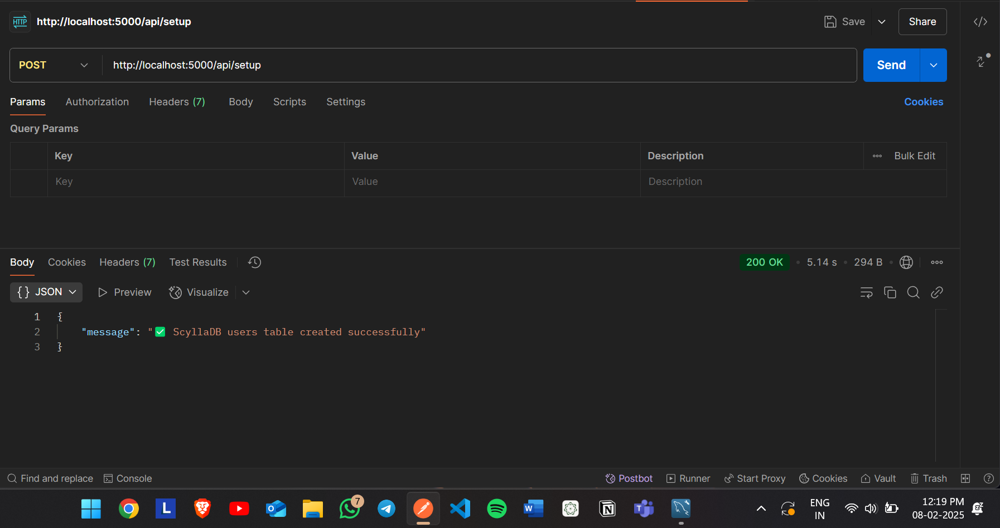
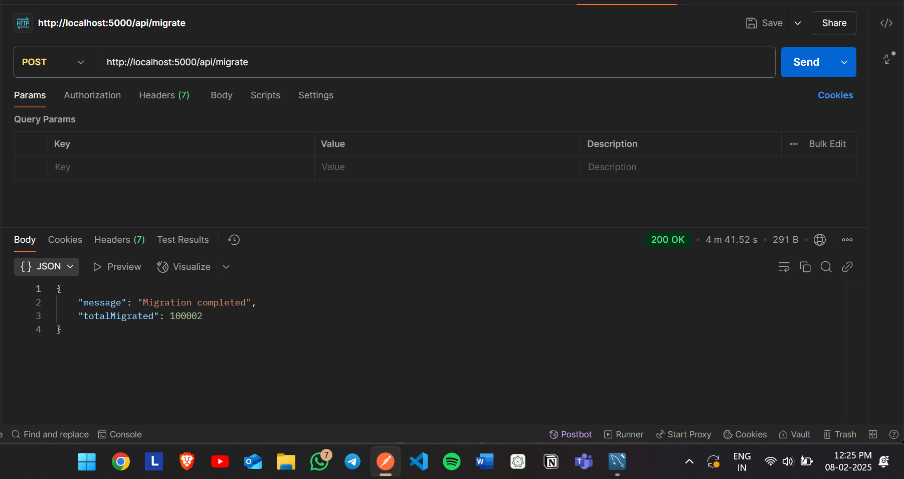
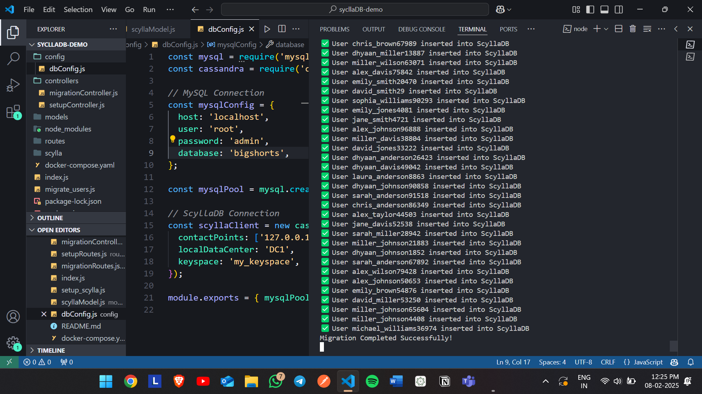
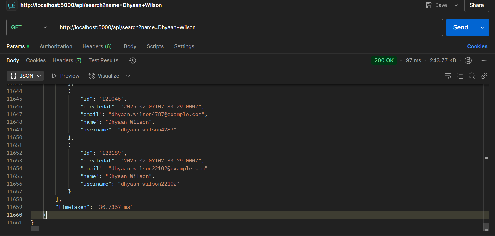

# MySQL to ScyllaDB Migration Tool
This Express/NodeJS program is for migrating user data from MySQL to ScyllaDB with built-in search APIs and time comparison features.

## Features
- Data migration from MySQL to ScyllaDB
- User search functionality in both databases
- Performance comparison between MySQL and ScyllaDB queries
- Automated ScyllaDB table setup

## Prerequisites
- Docker and Docker Compose
- Node.js (v14 or higher)
- MySQL database, SyllaDB
- npm or yarn

## Installation

1. Clone the repository:
```bash
git clone <your-repository-url>
cd <project-directory>
```

2. Install dependencies:
```bash
npm install
```

3. Configure database connections in `config/dbConfig.js`:
```javascript
// Example configuration
module.exports = {
  mysql: {
    host: 'localhost',
    user: 'your_user',
    password: 'your_password',
    database: 'your_database'
  },
  scylla: {
    contactPoints: ['localhost'],
    localDataCenter: 'DC1',
    keyspace: 'my_keyspace'
  }
}
```

## Database Setup

### MySQL Setup

1. Create the users table in your MySQL database:
```sql
CREATE TABLE users (
  id BIGINT AUTO_INCREMENT PRIMARY KEY,
  name VARCHAR(255),
  email VARCHAR(255) UNIQUE,
  username VARCHAR(255) UNIQUE,
  createdAt TIMESTAMP DEFAULT CURRENT_TIMESTAMP
);
```

### ScyllaDB Setup

1. Start the ScyllaDB cluster using Docker (Make you are in the ./docker-compose in your cmd):
```bash
docker-compose up -d
```

2. Verify the cluster is running:
```bash
docker ps
```

3. Connect to ScyllaDB:
```bash
docker exec -it scylla-node1 cqlsh
```

4. Create keyspace and table:
```sql
CREATE KEYSPACE my_keyspace 
WITH replication = {
  'class': 'NetworkTopologyStrategy', 
  'datacenter1': 3
};

USE my_keyspace;

CREATE TABLE users (
  id BIGINT PRIMARY KEY,
  name TEXT,
  email TEXT,
  username TEXT,
  createdAt TIMESTAMP
);

CREATE INDEX ON users(name);
```

## Usage

1. Start the application:

```bash
node setup_scylla.js
```
```bash
node index.js
```

2. Initialize ScyllaDB table:
```bash
curl -X POST http://localhost:5000/api/setup
```


3. Migrate data from MySQL to ScyllaDB:
```bash
curl -X POST http://localhost:5000/api/migrate
```



4. Search for users (compares performance between MySQL and ScyllaDB):
```bash
curl -X GET "http://localhost:5000/api/search?name=Harshal+Mahajan"
```


## API Endpoints

| Endpoint | Method | Description |
|----------|--------|-------------|
| `/api/setup` | POST | Initialize ScyllaDB tables |
| `/api/migrate` | POST | Migrate data from MySQL to ScyllaDB |
| `/api/search` | GET | Search users by name in both databases |

## Example Responses

### Migration Response
```json
{
  "message": "Migration completed",
  "usersMigrated": 100002
}
```

### Search Response
```json
{
  "message": "✅ Search Completed",
  "mysql": {
    "users": [],
    "timeTaken": "5.21 ms"
  },
  "scyllaDB": {
    "users": [],
    "timeTaken": "0.89 ms"
  }
}
```

## 📂 Project Structure
```
📦 scylladb-migration #To migrate from MySQL to ScyllaDB
├── 📂 config         # Database configurations
│   ├── dbConfig.js
├── 📂 controllers    # API controllers
│   ├── setupController.js
│   ├── migrationController.js
│   ├── searchController.js
├── 📂 models         # Database models
│   ├── searchModel.js
├── 📂 routes         # Express routes
│   ├── setupRoutes.js
│   ├── migrationRoutes.js
│   ├── searchRoutes.js
├── 📂 scylla          # Scylla configurations
│   ├── cassandra-rackdc.properties.dc1
│   ├── syclla.yaml
├──docker-compose.yaml # To create SyllaDB cluster on Docker
├── index.js           # Main server file
├── migrate_users.js   # MySQL -> ScyllaDB Tranfer
├── setup_scylla.js    # Table Creation on ScyllaDB
├── README.md          # Documentation
```

## Troubleshooting

### ScyllaDB Cluster Issues

If your ScyllaDB cluster is down:

1. Check cluster status:
```bash
docker ps -a
```

2. Restart existing containers:
```bash
docker start scylla-node1 scylla-node2 scylla-node3
```

3. For a fresh start (warning: deletes all data):
```bash
docker-compose down -v
docker-compose up -d
```

### Common Issues

1. **Connection Refused**: Ensure all ScyllaDB nodes are running and healthy
2. **Table Not Found**: Verify keyspace and table creation
3. **Migration Timeout**: Adjust batch size in migration settings

## Contributing

1. Fork the repository
2. Create your feature branch
3. Commit your changes
4. Push to the branch
5. Create a new Pull Request

## License

This project is licensed under the MIT License